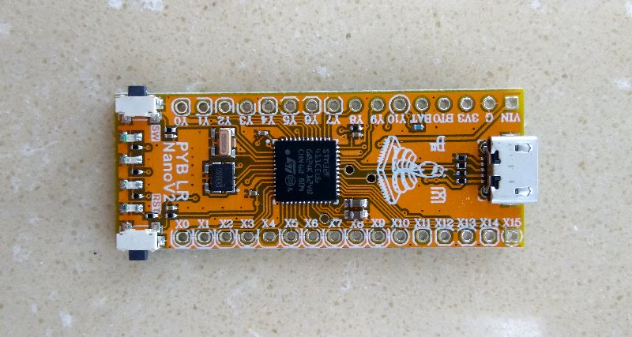

# pybNano v2

pybNano V2 is a **mini** micropython board, with STM32F411 microcontroller, 8 MByes flash, compatible with PYBV10. It is designer by micropython Chinese Community.

- [github](https://github.com/micropython-Chinese-Community/MicroPython_firmware/tree/master/PYBNanoV2)
- [gitee](https://gitee.com/microbit/MicroPython_firmware/tree/master/PYBNanoV2)